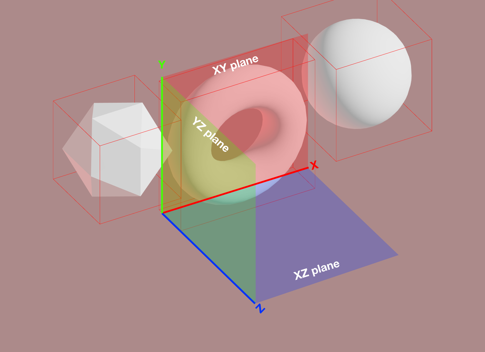

# react-three-flex 💠

`<Flex />` component for the 3D World. Inspired by the [yoga-r3f demo](https://codesandbox.io/s/yoga-r3f-lgl0j).

## Installation

```sh
npm i react-three-flex
```

## Example

```jsx
import React from 'react'
import { Flex, Box } from 'react-three-flex'
import { Sphere, Torus, Icosahedron } from 'drei'

const Layout = () => (
  <Flex justifyContent="center" alignItems="center" flexDirection="row" size={[500, 200, 0]}>
    <Box>
      <Sphere args={[50]} />
    </Box>

    <Box flexGrow={1}>
      <Torus args={[50, 10]} />
    </Box>

    <Box>
      <Icosahedron args={[50]} />
    </Box>
  </Flex>
)
```

## Usage

The layout works with two components, `<Flex />` as container and `<Box />` as a wrapper for 3D objects.

You simply wrap your 3D objects in different `<Box />` instances inside a flex container. This way they will be automatically placed in the 3D space like a DOM Flexbox.

```jsx
const Layout = () => (
  <Flex justifyContent="center" alignItems="center">
    <Box>{/* Your 3D component*/}</Box>
  </Flex>
)
```

You can tweak the container and the boxes using standard CSS flex properties, like `flexDirection` or `justifyContent` for the container and `flexGrow` for the boxes. There are also _shorthands_, like `align` and `justify`. See props docs below for more info.

### Sizing

The main difference between a DOM Flexbox and react-three-flex is that you don't have a parent container for the root flex, so you'll need to specify its dimensions using `size` prop, if you want it to be centered and perform grows or wrapping.

```jsx
const Layout = () => (
  <Flex flexDirection="row" flexWrap="wrap" size={[300, 200, 0]}>
    <Box>
      <Sphere args={[50]} />
    </Box>
    <Box>
      <Torus args={[50, 10]} />
    </Box>
    <Box>
      <Icosahedron args={[50]} />
    </Box>
  </Flex>
)
```

**⚠️ WATCH OUT!** Yoga flexbox engine uses integer numbers to perform layout calculation, so to preserve precision make sure you choose big enough numbers for sizes.


### Axis Orientation

Another important difference with DOM Flexbox is that you can specify the direction of the container in 3D, using an axis and its normal. The elements will be positioned in the 2D plane given by the axis and normal.

In fact, the 2D flex container width and height will be calculated looking at the `size` prop with respect of the chosen axes (200 and 100 in this example).

```jsx
const Layout = () => (
  <Flex mainAxis="z" crossAxis="y" size={[0, 100, 200]}>
    {/* many <Box /> items */}
  </Flex>
)
```



### Margin and Padding

### Nesting

Since a `<Flex />` component works the same way as a DOM one, you can easily make complex layouts by nesting flex containers.

```jsx
import React from 'react'
import { Flex, Box } from 'react-three-flex'
import { Sphere, Torus, Icosahedron } from 'drei'

const Layout = () => (
  <Flex flexDirection="row" flexWrap="wrap" size={[50, 0, 0]}>
    <Box>
      <Sphere />
    </Box>

    <Box>
      <Flex flexDirection="column" flexWrap="no-wrap">
        <Sphere />
        <Sphere />
        <Sphere />
      </Flex>
    </Box>

    <Box>
      <Icosahedron />
    </Box>
  </Flex>
)
```

## API

Both `<Flex/>` and `<Box />` components shares the same props API:

### Align

```ts
type Align =
  | YogaAlign
  | 'auto'
  | 'baseline'
  | 'center'
  | 'flex-end'
  | 'flex-start'
  | 'space-around'
  | 'space-between'
  | 'stretch'

{
  alignContent: Align
  alignItems: Align
  alignSelf: Align
  align: Align
}
```

### Justify

```ts
type JustifyContent =
  | YogaJustifyContent
  | 'center'
  | 'flex-end'
  | 'flex-start'
  | 'space-between'
  | 'space-evenly'
  | 'space-around'

{
  justifyContent: JustifyContent
  justify: JustifyContent
}
```

### Direction

```ts
type FlexDirection = YogaFlexDirection | 'row' | 'column' | 'row-reverse' | 'column-reverse'

{
  flexDirection: FlexDirection
  flexDir: FlexDirection
  dir: FlexDirection
}
```

### Wrap

```ts
type FlexWrap = YogaFlexWrap | 'no-wrap' | 'wrap' | 'wrap-reverse'

{
  flexWrap: FlexWrap
  wrap: FlexWrap
}
```

### Flex basis

```ts
flexBasis: number
```

### Grow & shrink

```ts
flexGrow: number
flexShrink: number
```

### Height & width

```ts
height: Value
width: Value
maxHeight: Value
maxWidth: Value
minHeight: Value
minWidth: Value
```

### Padding

```ts
padding: Value
p: Value
paddingTop: Value
pt: Value
paddingBottom: Value
pb: Value
paddingLeft: Value
pl: Value
paddingRight: Value
pr: Value
```

### Margin

```ts
margin: Value
m: Value
marginTop: Value
mt: Value
marginLeft: Value
ml: Value
marginRight: Value
mr: Value
marginBottom: Value
mb: Value
```

## License

[MIT](LICENSE)
